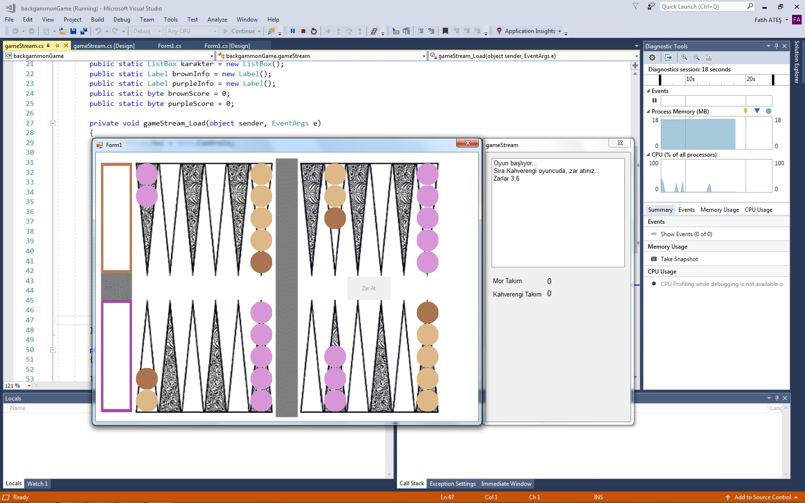

## English Description

&emsp;&emsp;This backgammon game developed with OOP under .NET Framework 4.6.1 and on VS 2017 using C# WFA.

### Notes

&emsp;&emsp;It is not a completely finished game. In my spare time I will try to improve the game. Can be used as desired.
The main idea in the development of the game is to understand the OOP logic.

### Game Stream
&emsp;&emsp;The game flow is effective with stone movements, dice movements and undo buttons.
The stones of the Purple and Brown team are the controls with a set of features (column, old column, etc.) that are inherited from the button.
When the stone is dragged and dropped, the dice is transferred to the areas where the stone can go by calculating where the stone will go.

## Türkçe Açıklama

&emsp;&emsp;C# WFA altında .NET Framework 4.6.1 ve VS 2017 kullanılarak geliştirilmiş bir tavla oyunu.

### Notlar

&emsp;&emsp;Tam anlamıyla bitmiş bir oyun değildir. Vakit buldukça geliştirmeye çalışacağım. Gönül rahatlığıyla alıp kullanılabilir.
Uygulamanın aslen hizmet ettiği araç OOP ile WFA üzerinde geliştirme yapmaktır.

### Oyun Akışı
&emsp;&emsp;Oyun akışı taş hareketleri zar hareketleri ve geri alma butonlarıyla birebir etkilidir.
Mor ve Kahverengi takımın taşları butondan kalıtılmış bir takım özellikleri olan (kolon,eski kolon vb.) kontrollerdir.
Taş sürüklenip bırakıldığı anda atılan zar ile sürüklenen taşın nereye gideceği hesaplanarak gidebileceği alanlara aktarılması gerçekleşir.

### Ekran Görüntüsü/Screenshot
 